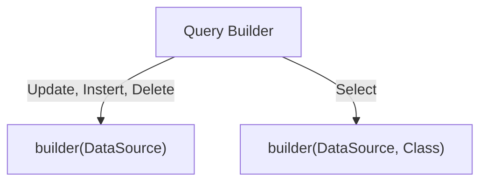
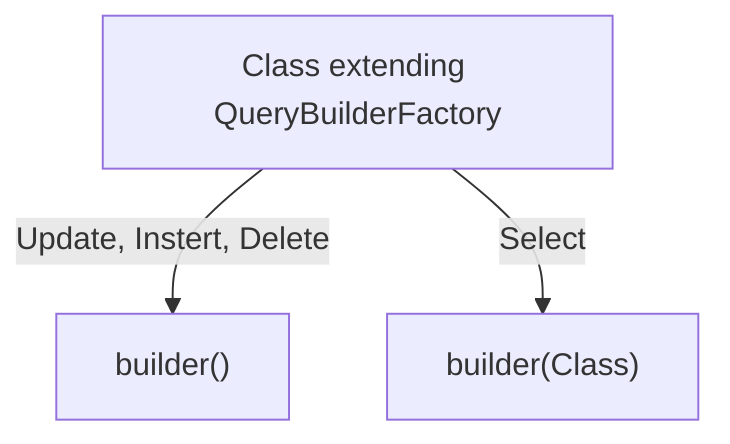
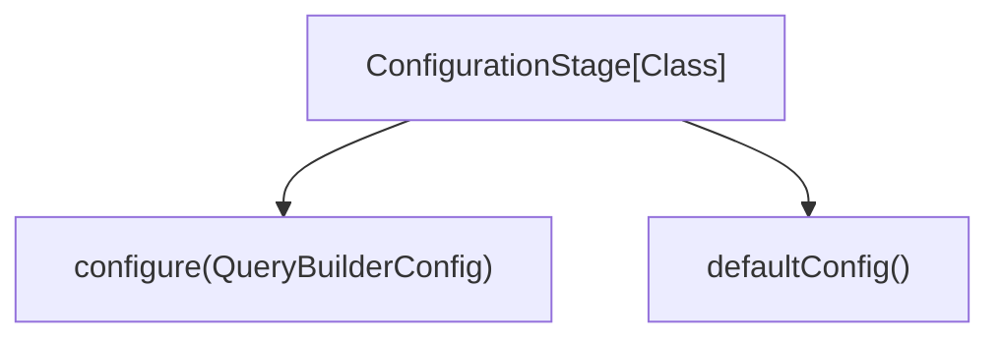
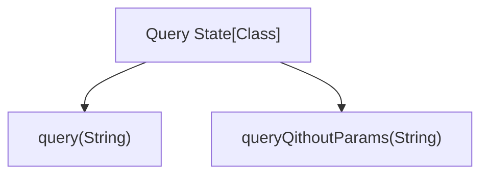
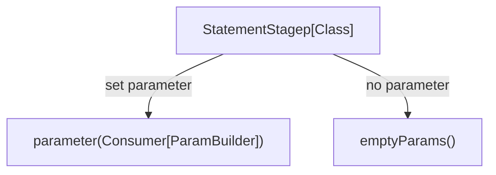
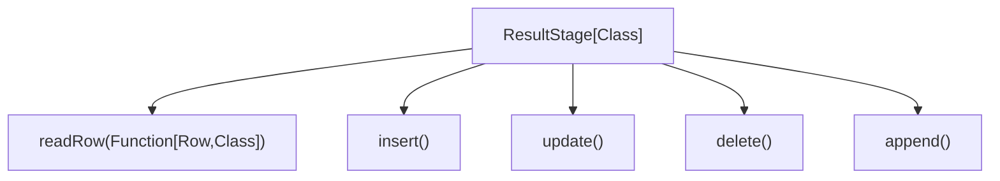
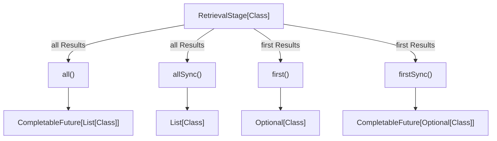
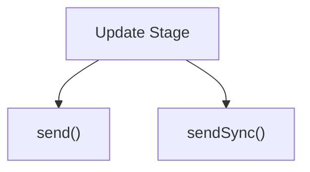
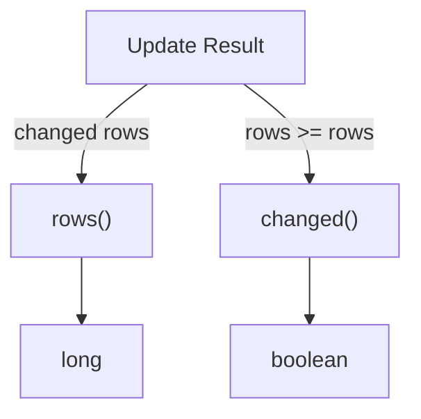
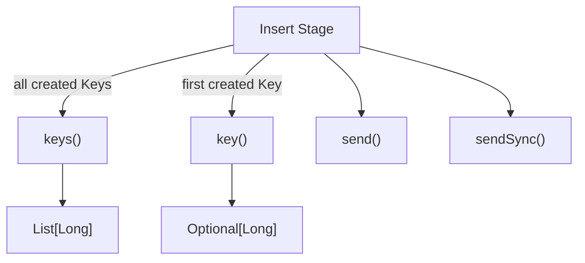

# Stages

The QueryBuilder uses a stage system to guilde you through the creation of your calls. If you didnt used
the `QueryBuilderFactory` to obtain your builder, you will start in the [ConfigurationStage](#ConfigurationStage) and
otherwise in the [QueryStage](#QueryStage)

Here is a "small" overview about the paths you can take in the query builder.

<details>
<summary>Overview</summary>


</details>

## Obtaining a builder

You can simply call the Query Builder class directly or let your class extend a `QueryFactory` to get a
preconfigured builder. This will also no longer require to pass a datasource every time.





## ConfigurationStage



The `ConfigurationStage` allows you to set your `QueryBuilderConfig`.

You can apply your configuration here or just use the default config. It is recommended to define your own default
config above.

This stage is only available when using the builder directly. It is highly recommended to extend your class with
`QueryFactory` and use the provided builder() method.

## QueryStage



The `QueryStage` allows you to set your query with parameter for a `PreparedStatement`.

If you don't have parameter you can call `QueryStage#queryWithoutParams(String)` to skip
the [StagementStage](#StatementStage).

## StatementStage



The `StagementStage` allows you to invoke methods on the PreparedStatement.

The `ParamBuilder` allows you to set the parameter in the order you defined them in your query.

```java
    public void createUser(String name, int age){
        builder().query("INSERT INTO user(name, arge) VALUES(?,?)")
                .parameter(p -> p.setString(name).setInt(age))
                .insert()
                .send();
    }
```

## ResultStage



The `ResultStage` allows you to define what your query does.

You can insert which will give you an [Insert Stage](#insertstage).

You can also read rows of your result set when you have a `SELECT` or `RETURNING` statement in your query.


If you want to execute and additional query, call append and add another one.

### Reading data

If you want to read data you have to call `ResultStage#readRow(ThrowingFunction<T, ResultSet, SQLException> mapper)`.

Now you have to map the current row to a object of your choice. This has to be the class you provided on creation of the
QueryBuilder.

**Note: Do only map the current row. Do not modify the ResultSet by calling `ResultSet#next()` or something else.**

Calling these functions will return a [RetrievalStage](#RetrievalStage).

### Update and delete

These methods will simply execute the query.

Calling these functions will return a [UpdateStage](#UpdateStage).

Update and delete will give you an [UpdateResult](#Updateresult)

### Insert

These methods will insert the data into your database.

Calling this method will return a [InsertStage](#InsertStage).

Insert will give you an [UpdateResult](#UpdateResult) or the created keys

### Append

You can also append another query by calling `StatementStage#append()`. This will return a `QueryStage` and allows you
to set another query.\
All queries will be executed in the order they were appended and with a single connection.

## RetrievalStage



The `RetrievalStage` allows you to actually call the queries you entered before.

If you want to retrieve the first or only one result call the `RetrievalStage#first` or `RetrievalStage#firstSync`
method. This will return the rows as a list mapped via the function provided in the [ResultStage](#ResultStage).

If you want to retrieve all entries in the `ResultSet` call `RetrievalStage#all` or `RetrievalStage#allSync`

## UpdateStage



The update stage allows you to update entries in your table.

Calling the send methods will give you an update result

### UpdateResult



The udpate result contains the modified rows and a method which will return a boolean when at least one row changed.

## InsertStage




The insert stage offers the same as the UpdateStage, but allows you to retrieve created keys as well. This is not
fully supported by all databases.
