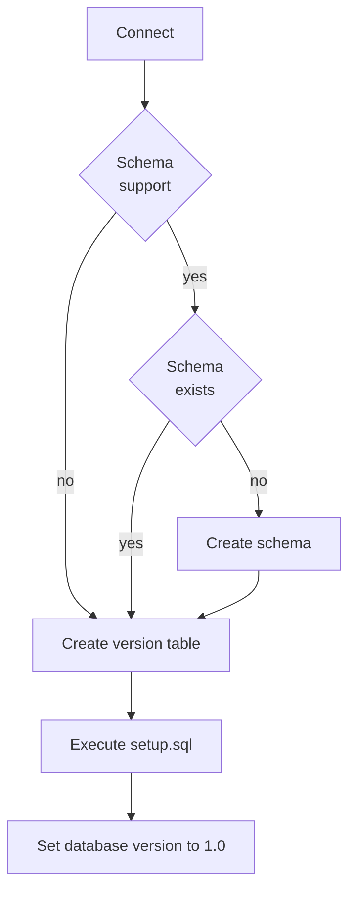

# Execution

So execute the updater, we need to create a instance of it, pass a datasource and execute it after some minimal
configuration.

```java
class Updater {
    private final DataSource dataSource;

    Updater(DataSource dataSource) {
        this.dataSource = dataSource;
    }

    public void update() throws IOException, SQLException {
        // We create our updater for the postgres database.
        // By setting the type our updater knows which directory it needs to search for our scripts.
        SqlUpdater.builder(dataSource, PostgreSql.get())
                // For easier development on our dev system we use a dev_schema in our database
                // During deployment we want to change the name to live_schema
                .setReplacements(new QueryReplacement("dev_schema.", "live_schema."))
                // Our version should be stored in this table. Changing the table later can cause trouble.
                // By default the table name will be only "version"
                .setVersionTable("my_app_version")
                // We want to deploy to the live_schema.
                // By defining it here, the updater will create this schema if it doesnt exist
                .setSchemas("live_schema")
                // In the end we execute out update.
                .execute();
    }
}
```

What happens now?

On the first startup the updater will do the following:

1. Check if the schema exists and creates it if missing. (This only works on databases which actually support schemas)
2. Create a version table
3. Execute the setup.sql file
4. Set the database version to 1.0


