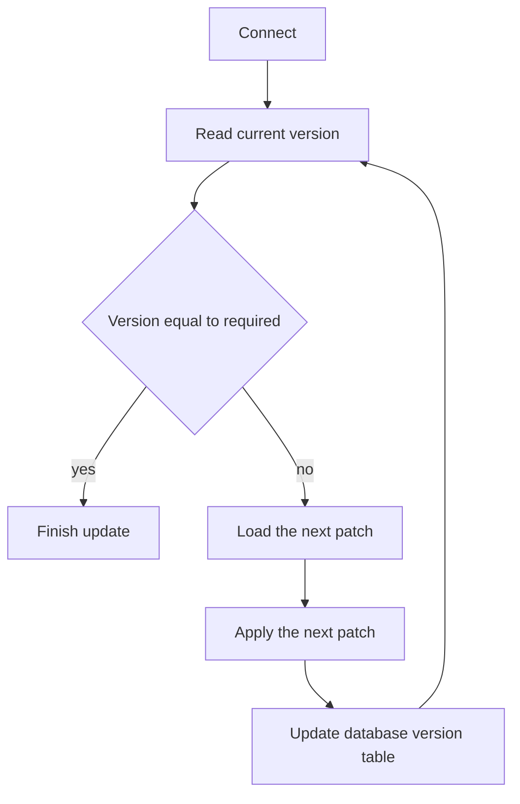

# Adding a patch

If you want to deploy changes on an existing database you need to add a patch. At some point you will have multiple
patches for your database. After some time your directory will look like this:

```
resources
  database
    postgresql
      1
        setup.sql       # Setup for 1.0
        patch_1.sql     # Patch for 1.1
        patch_2.sql     # Patch for 1.2
        patch_3.sql     # Patch for 1.3
    version             # The version is now 1.3
```

What happens now if we execute the updater on the database with version 1.0 we created previously?

1. Compare the version of the version table and our version file.
2. Check whether the versions are equal.
3. If not apply patches one after another until the next version is reached.
3. Execute them one after another.


